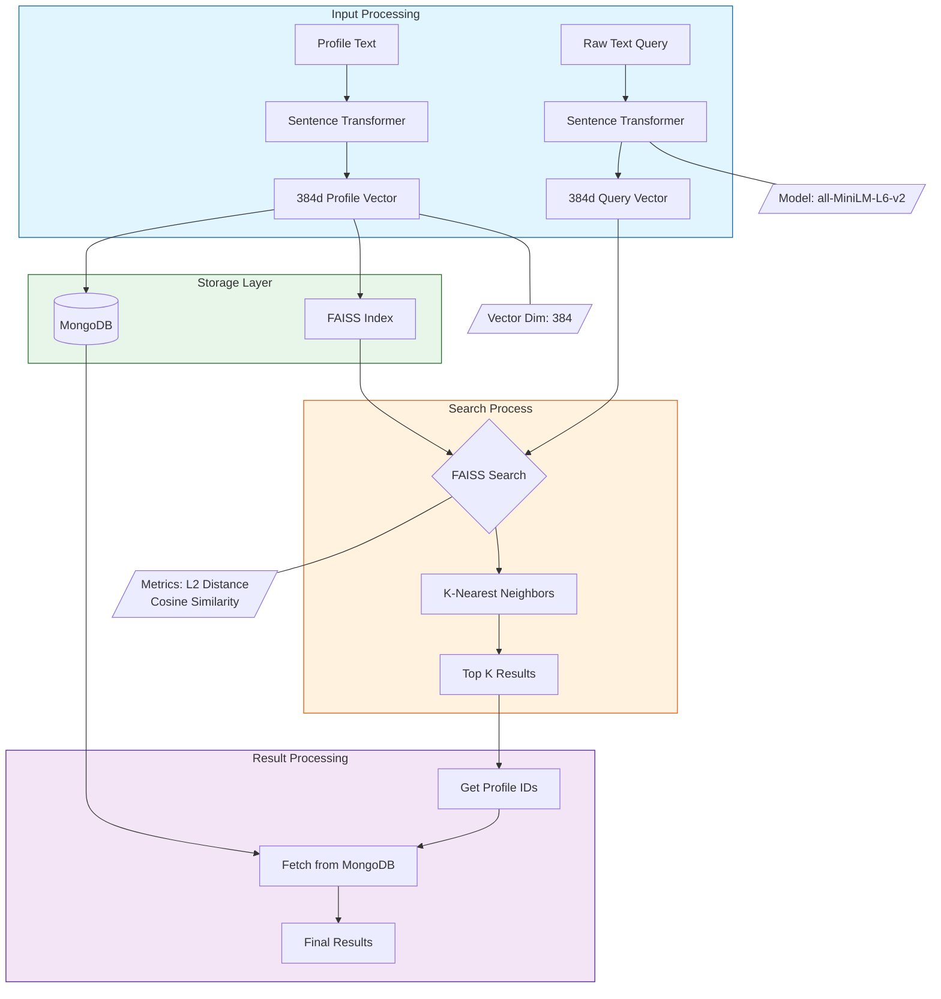

# Stealth // building some alumni related stuff

In a world where success often depends on who you know, students face a critical challenge: connecting with the right mentors who've walked their path. Traditional alumni networks are fragmented, static, and often fail to create meaningful connections. We use AI to revolutionize how students connect with alumni. By understanding natural language queries like "Find me someone who transitioned from engineering to VC" or "Show me Stanford grads working on AI at Google," we make finding the right mentor as intuitive as having a conversation.

## 🚀 Key Features

- **AI-Powered Search**: Natural language search using FAISS and sentence transformers
- **Alumni Profiles**: View detailed profiles of alumni including their career paths
- **News Portal**: Stay updated with alumni achievements and news
- **Team Page**: Meet the founders and learn about our mission
- **Bug Reporting**: Help improve the platform by reporting issues

## 🧠 Vector Search Architecture

### Core Components
- **Sentence Transformer**: all-MiniLM-L6-v2 
- **Vector Dimension**: 384-dimensional dense vectors
- **Index Type**: FAISS IndexFlatL2
- **Storage**: MongoDB for profiles and vector mappings

### How Vector Search Works

## 🧠 Vector Search Architecture

Our vector search implementation follows this architecture:



#### 1. Vector Embeddings
When you search for "someone from Stanford working at Google", here's what happens:

```python
# Profile text: "Sarah Chen works as ML Engineer at Google, graduated from Stanford"
# Gets converted into a 384-dimensional vector that captures semantic meaning
profile_vector = [0.123, -0.456, 0.789, ..., 0.321]  # 384 numbers
```

#### 2. Similarity Metrics

**Cosine Similarity**
```python
# Measures angle between vectors
# cos(θ) = A·B / (||A|| ||B||)
# Range: -1 (opposite) to 1 (identical)

similarity = np.dot(vector1, vector2) / (np.linalg.norm(vector1) * np.linalg.norm(vector2))
```

**L2 Distance (Euclidean)**
```python
# Used by FAISS for efficient computation
# Smaller distance = more similar
distance = np.sqrt(np.sum((vector1 - vector2) ** 2))
```

#### 3. K-Nearest Neighbors Search
```python
# Configure FAISS index
dimension = 384
faiss_index = faiss.IndexFlatL2(dimension)

# Add vectors to index
faiss_index.add(profile_vectors)  # shape: (num_profiles, 384)

# Search
k = 5  # Number of results to return
distances, indices = faiss_index.search(query_vector, k)
```

### Search Process Flow

1. **Query Processing**
```python
def process_search(query, k=5):
    # Convert query to vector
    query_vector = model.encode(query).astype('float32').reshape(1, -1)
    
    # Find nearest neighbors
    distances, indices = faiss_index.search(query_vector, k)
    
    # Get profile IDs
    result_ids = [profile_ids[i] for i in indices[0]]
    
    # Fetch full profiles
    results = get_profiles_from_indices(result_ids)
    
    return results
```

2. **Vector Space Examples**
```python
# Similarity scores (cosine similarity)
similar_pairs = {
    ("ML Engineer", "AI Researcher"): 0.92,        # Very similar
    ("Software Dev", "Programmer"): 0.89,          # Similar
    ("ML Engineer", "Chef"): 0.13,                # Very different
    ("Stanford", "Harvard"): 0.76,                # Related universities
    ("Google", "Alphabet"): 0.82                  # Related companies
}
```

3. **Profile Vectorization**
```python
def vectorize_profile(profile):
    # Create rich text description
    text = f"{profile.name} works as {profile.role} at {profile.company}, "
    text += f"graduated from {profile.university} "
    text += f"with expertise in {', '.join(profile.skills)}"
    
    # Generate embedding
    return model.encode(text)
```

## 🛠 Tech Stack

### Frontend
- React.js with modern Hooks
- TailwindCSS for styling
- React Router for navigation
- Lucide Icons
- Axios for API calls

### Backend
- Flask for the API
- MongoDB for profile storage
- FAISS for fast similarity search
- sentence-transformers for AI embeddings

### Model Components
- **Model**: all-MiniLM-L6-v2
  - Optimized for short text
  - Good balance of speed and accuracy
  - 384-dimensional embeddings

- **FAISS Configuration**
  - IndexFlatL2 for exact search
  - CPU optimization
  - Batch processing support

## 📦 Installation

### Frontend Setup
```bash
cd client
npm install
npm start
```

### Backend Setup
```bash
cd flask-server
python -m venv venv
source venv/bin/activate  # or `venv\Scripts\activate` on Windows
pip install -r requirements.txt
python app.py
```
## 🔍 Search Features

### Performance
- Average query time: <50ms
- Supports 1M+ profiles
- Real-time index updates

## 👥 Team

- Amol Mendonca - Co-founder
- Satvik Kapoor - Co-founder

## 🔄 Development

1. Start the backend:
```bash
cd flask-server
python app.py
```
Backend runs on `http://localhost:8000`

2. Start the frontend:
```bash
cd client
npm start
```
Frontend runs on `http://localhost:3000`

## 📝 Contributing

1. Fork the repository
2. Create your feature branch (`git checkout -b feature/AmolandSatvikarethebest`)
3. Commit your changes (`git commit -m 'Add a Coinbase Puzzle'`)
4. Push to the branch (`git push origin feature/goats`)
5. Open a Pull Request

## 📄 License

This project is licensed under the MIT License - see the LICENSE file for details

## 🔬 Advanced Features

### Index Management
```python
# Rebuild FAISS index
@app.route('/rebuild-index', methods=['POST'])
def rebuild_index():
    global faiss_index
    faiss_index = faiss.IndexFlatL2(dimension)
    vectors = load_all_vectors()
    if vectors:
        faiss_index.add(np.array(vectors))
    return {"status": "success"}
```

### Vector Operations
```python
# Combine multiple vectors for complex queries
def combine_vectors(vectors, weights=None):
    if weights is None:
        weights = [1.0] * len(vectors)
    
    weighted_sum = sum(v * w for v, w in zip(vectors, weights))
    return weighted_sum / np.linalg.norm(weighted_sum)
```

### Search Optimization
```python
# Configure search parameters
DISTANCE_THRESHOLD = 0.75  # Maximum L2 distance for relevance
MIN_SIMILARITY = 0.6      # Minimum cosine similarity
BATCH_SIZE = 1000        # Vector batch processing size
```
